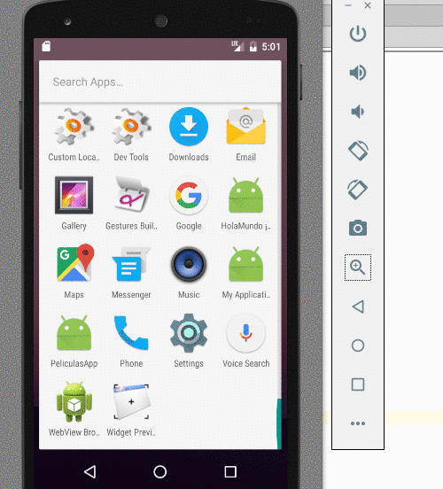

# Búsqueda de Películas en Android

 

Esta es una aplicación Master/Detail donde se visualizan películas disponibles de un stock.

## El proyecto
Este proyecto está generado para

* Android Studio 2.2 (Septiembre 2016)
* con Gradle 2.14.1 (el que viene con Android Studio)
* para una SDK 24 (Nougat)

## Conceptos que se ven en la app

* Uso de Activities vs. Fragment para manejar diferentes dispositivos
* Navegación entre vistas mediante el uso de Intent
* Redefinición del layout de una ListView y del detalle de una película
* Binding manual de propiedades entre objetos de dominio (Película / Genero) y objetos visuales

